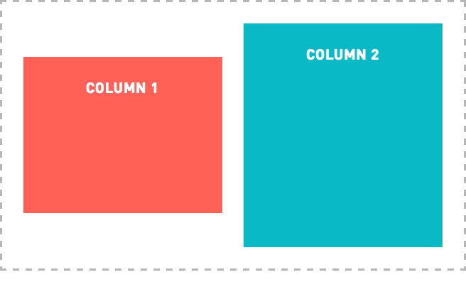

# How to Vertically Middle-Align Floating Elements w/ Flexbox

## Desired Layout 

## Default Layout 

### Vertical-Align Middle
`vertical-align: middle;` does not work.

[MDN](https://developer.mozilla.org/en-US/docs/Web/CSS/vertical-align)
> **"The vertical-align CSS property specifies the verical alignment of an _inline_ or _table-cell box_."**

To start elements aren't inline, inline-block, or table-cells, so this rule won't be in effect.

Also, our grid uses 
`float: right`
to position our column elements. 

[MDN](https://developer.mozilla.org/en-US/docs/Web/CSS/float) 
> **As mentioned above, when an element is floated, it is taken out of the normal flow of the document (though still remaining part of it). It is shifted to the left, or right, _until it touches the edge of its containing box, or another floated element_.**

The first issue is easy to solve. Simply change the spl	ay property to:; to the container.
ii.	Add
`display: inline-block;```

Unfortunately there isn't a fix for the second issue. The float properties would have to be removed, which would interfere with the underlying grid.

## Flexbox Solution

	i. 	Add: display: flex; to the container.
	ii.	Add: align-items: center; to the container
	
HTML
```
<main class="container">
 <section class="column-1">[Dynamic content]</section>
 <section class="column-2">[Dynamic content]</section>
</main>
```	
CSS
```
.container {
  display: flex;
  align-items: center;
}

.column-1,
.column-2 {
  float: left;
  width: 50%;
}
```
This aligns both columns to the center of the container regardless of the container's height.



This approach not only solves the  problem, but also leaves a fallback for older browsers with the float properties in the columns.